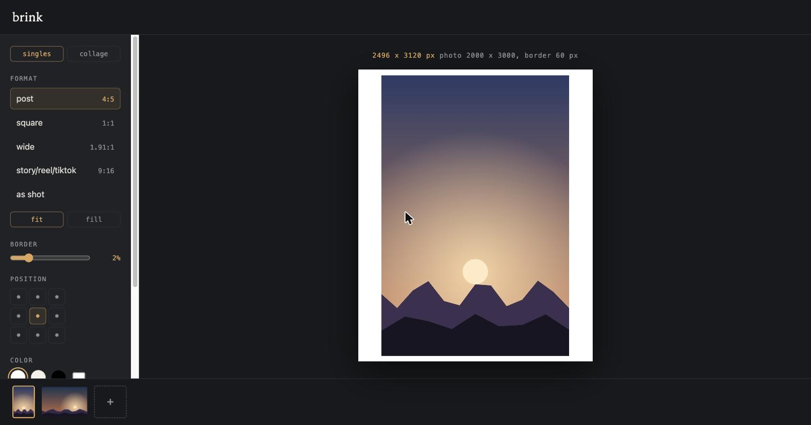
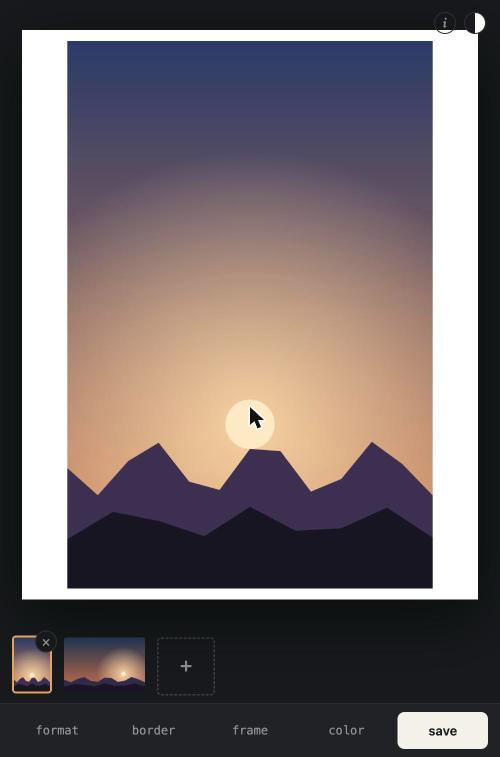

# brink

add clean borders to your photos for instagram, stories and tiktok. everything runs in your browser, your photos never leave your device.

**[use it here](https://sergiopaniego.github.io/brink/)**

 

## features

- exact ratios for every format: post 4:5, grid 3:4 (safe in the profile grid), square 1:1, wide 1.91:1, story/reel/tiktok 9:16, or keep the ratio as shot
- every photo remembers its own settings, switch between them freely
- undo and redo any edit, cmd z works too
- split: one wide photo becomes 2 or 3 sequential posts that align as you swipe
- fit keeps the whole photo and fills the ratio with the border color, fill crops to the ratio instead
- pixels are never resampled: fit pads, fill is a pure crop, the photo stays at native resolution
- wide gamut respected: on modern browsers the whole pipeline runs in display p3, iphone colors export intact
- drag to reframe, pinch or slide to zoom, twist two fingers or slide to rotate the full turn, the readout says when something resamples
- collage: 2x1, 1x2, 3x1, 2x2 and side by side templates, place any photo in any cell, leave cells empty, reframe each cell on its own
- border size and color are configurable, defaults to a small white border
- film frames: generated scan style rebates from a hand curated seed set, no stored images, every photo gets its own
- film grain, seeded per photo, speck size tracks resolution so every export looks the same
- batch: load several photos, remove any, tweak once, save all
- exports jpeg (quality 97) or png, output size always visible
- on your phone the share sheet saves straight to the photo library
- installable: add to home screen on ios or android and it opens like an app
- preview on a dark or light background, to judge the border the way the feed will show it
- up to 20 photos, the instagram carousel limit

## develop

the whole app is a single `index.html`. no build step, no dependencies, no server.

```
git clone https://github.com/sergiopaniego/brink
open brink/index.html
```

any static server also works, for example `python3 -m http.server`.

[test.html](https://sergiopaniego.github.io/brink/test.html) runs the whole test suite in the browser, every action checked, green or red. open it from a server, not from file://.

built with ai assistance.
